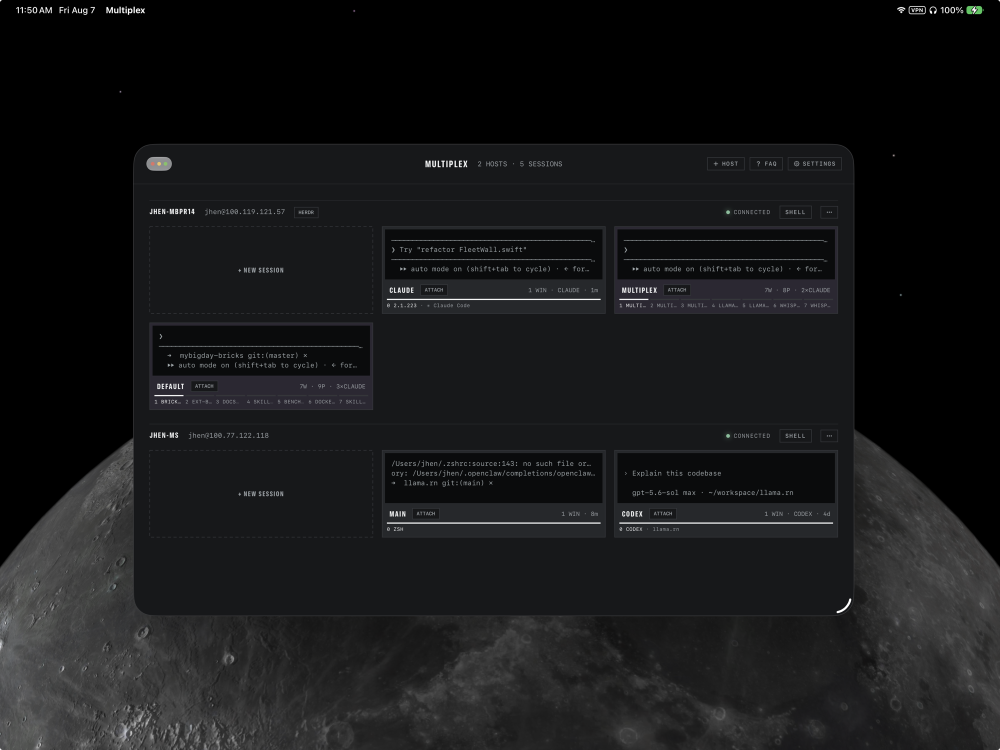

# Multiplex

A spatial SSH terminal for people who live inside remote **tmux** — visionOS
first, iPadOS and iPhone alongside, with [herdr](https://herdr.dev) available
as a per-host session backend. The deck is a fleet-wide **monitor wall**: every
host probes concurrently, every session renders as a live `capture-pane` tile,
and each attach opens its own window you can place around the room.

[App Store](https://apps.apple.com/us/app/multiplex-ssh-tmux-terminal/id6790074057)
· [multiplexterm.dev](https://multiplexterm.dev) ·
[Design rationale](DESIGN.md) · [Contributor guide](AGENTS.md)


## What it does

- **The wall** — add hosts by password or OpenSSH key, or by running the
  companion `mpx bind` CLI on the machine itself (QR, Bonjour, or opt-in
  clipboard). Hosts, secrets, and per-host settings sync through iCloud
  Keychain — end-to-end encrypted, no server of ours. Each host probes over a
  single exec round-trip (~5 s while the deck is frontmost) and renders tiles
  carrying the session's last lines, a window spine, a captioned **LIVE** tally,
  and telemetry. One host can show tmux *and* herdr sessions at once.
- **Windows and tabs** — a session attaches into its own scene (spatial windows
  on visionOS, Stage Manager on iPad, an adaptive single-window shell on
  iPhone). Windows hold ordered tabs; **Merge** pulls another window's tabs in,
  drag reorders, and a tab moved between windows keeps its live SSH connection,
  buffer, and scrollback. Below every window sits the **UMD** — the
  under-monitor display carrying source label, status lamp, and controls.
- **Agent awareness** — when a pane (or a plain SSH shell) runs Claude Code,
  Codex, or Pi, Multiplex detects it from several independent signals and
  follows it with a per-host command strip. Turn-end, question, and permission
  states surface as a **NEEDS YOU** tally on the wall and as notifications when
  you have walked away. Claude Code's own session file backs a HISTORY panel
  that can jump the pane back to an earlier prompt.
- **Terminal input, done properly** — one app-wide keyboard-focus arbiter, an
  app-owned key rail (ESC, latching CTRL, arrows, page keys, backend shortcut
  panel), multilingual IME and dictation, remote scrolling, tmux Copy Mode as a
  contextual state, and a pane-clamped **Select Text** mode that works on both
  backends.
- **Beyond the shell** — confirmed links open in a docked **viewport** tab;
  confirmed paths open read-only in a **File Viewer** tab (source, rendered
  Markdown, images, git diffs). Files upload over SFTP into the active pane's
  working directory and their path is typed, never submitted.
- **Transports** — SSH throughout, plus an optional clean-room **mosh** client
  (UDP) per host; SSH stays the control plane for probing, exec, and SFTP.
- **Chrome** — System / Light / Dark everywhere, plus a smoked **Glass**
  appearance on Vision Pro. Terminal color schemes are separate from the
  chassis: ten built-ins plus a full custom-theme editor. Home Screen widgets,
  App Shortcuts, and a `multiplex://` deep-link scheme drive the same routes the
  app uses internally.




The App Store build gates a few things behind a Multiplex Pro purchase
(unlimited hosts, mosh, unmetered agent chips, agent alerts, HISTORY, custom
themes) — the split is documented in
[`docs/store-metadata.md`](docs/store-metadata.md). This repository is the whole
app; nothing is held back.

## Building

Requires Xcode with the visionOS SDK and
[XcodeGen](https://github.com/yonaskolb/XcodeGen). The `.xcodeproj` is
generated — edit `project.yml`, never the project file.

```sh
xcodegen generate
xcodebuild -project Multiplex.xcodeproj -scheme Multiplex \
  -destination 'platform=visionOS Simulator,name=Apple Vision Pro' \
  -derivedDataPath DerivedData build
```

The same scheme builds for iOS (`-destination 'platform=iOS Simulator,name=iPad
Pro 13-inch (M5)'`); never run both against one `DerivedData` concurrently.
Tests live in the `MultiplexTests` scheme, lint is `./Tools/build.sh lint`
(SwiftLint, `--strict`, zero violations). Minimum visionOS 1.0 / iOS 17.

[`AGENTS.md`](AGENTS.md) is the contributor guide: architecture, the layer rule
(Views → Services → Models), and the load-bearing decisions behind code that
looks arbitrary until you know why.

## End-to-end without a remote server

`Tools/dev-sshd/harness.sh` runs a user-mode sshd on `127.0.0.1:2222` with its
own keys under `Tools/dev-sshd/state/` — it never touches `~/.ssh`:

```sh
./Tools/dev-sshd/harness.sh start   # keys + sshd + writes state/seed.json
./Tools/dev-sshd/harness.sh demo    # tmux sessions: main, scratch, deploy, agent
./Tools/dev-sshd/harness.sh herdr   # herdr sessions with deterministic states
./Tools/dev-sshd/harness.sh stop
```

The simulator shares the Mac's network, so launching a DEBUG build with
`MULTIPLEX_SEED_HOST` pointing at `state/seed.json` imports a ready `devbox`
host. Dozens of further DEBUG hooks drive attach, drops, bind, dictation, and
the rest headlessly — they are catalogued in `AGENTS.md`.

## Third-party code

| Library | Version | Role |
| --- | --- | --- |
| [SwiftTerm](https://github.com/migueldeicaza/SwiftTerm) | 1.15.0, vendored | The terminal emulator view. Vendored at `Vendor/SwiftTerm` (rev `dd2fb8a`) with twelve groups of Multiplex patches, each marked `Multiplex patch`. |
| [Citadel](https://github.com/orlandos-nl/Citadel) | 0.12.0 (exact) | Async/await SSH on SwiftNIO: PTY shell, exec, SFTP, OpenSSH key parsing. |
| [swift-nio-ssh](https://github.com/apple/swift-nio-ssh) | 0.3.5, vendored | Citadel's resolved fork, vendored at `Vendor/swift-nio-ssh` with a one-line manifest fix. |

Citadel is pinned to **0.12.0** deliberately: 0.12.1 moved its `swift-nio-ssh`
dependency to an unaudited personal fork. Review before bumping — this is the
transport. The mosh stack in `Multiplex/Services/Mosh` is clean-room from
published protocol facts and contains no code from the GPLv3 mosh project. The
full audited inventory of everything linked into the binary, with license texts,
is `Multiplex/Models/LicenseCatalog.swift` — the same list Settings ▸ About ▸
Open Source Licenses renders.

## Known limits

- **Host-key validation is `.acceptAnything()`.** Trust-on-first-use pinning
  through Citadel's `.custom` validator is the open TODO; treat connections over
  untrusted networks accordingly.
- Remote command PATH fixups assume a POSIX-ish login shell; csh/fish users may
  need tmux on the default PATH.
- Held-backspace auto-repeat rides an input filler that has only been verified
  on device — see the Known limits section of `AGENTS.md`.

## License

Apache License 2.0 — see [LICENSE](LICENSE) and [NOTICE](NOTICE).
