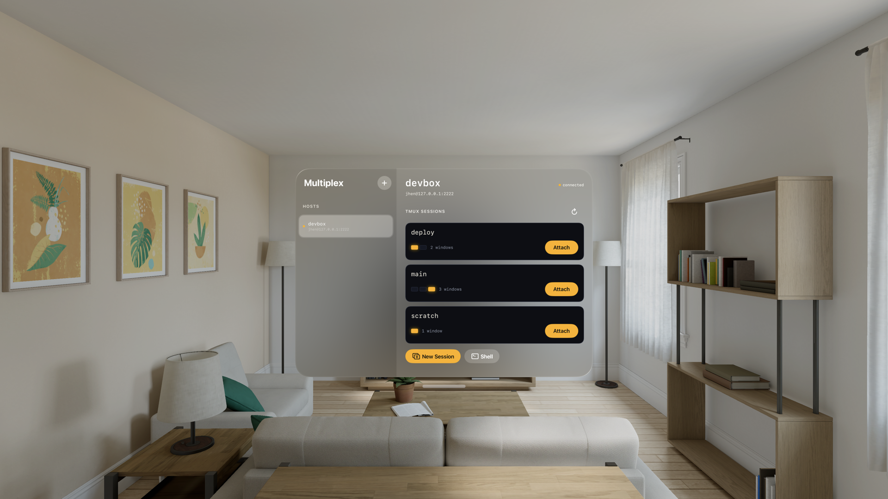
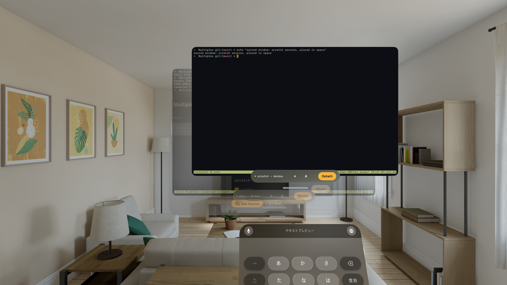

# Multiplex

A spatial SSH terminal for people who live inside remote tmux sessions —
with [herdr](https://herdr.dev) available as a per-host session backend.
**visionOS first, iPadOS alongside.** Every session gets its own window
you can place around the room; the deck is a fleet-wide **monitor wall** that
shows every session live — its actual last lines, window spine, and a tally
lamp when it's attached — before you ever attach.

*Design rationale and tokens: [DESIGN.md](DESIGN.md). The identity bake-off
that produced it: [docs/design-bakeoff.md](docs/design-bakeoff.md). The
product site — the App Store listing's marketing URL and privacy policy — is
maintained in [multiplex-home](https://github.com/jhen0409/multiplex-home)
and served at [multiplexterm.dev](https://multiplexterm.dev). Its own design
bake-off is recorded in [docs/landing/](docs/landing/).*





## What it does

- **The wall (deck)** — add SSH hosts (password or OpenSSH ed25519/RSA key,
  secrets in the Keychain); hosts, command setups, and secrets sync to your
  other devices through iCloud Keychain — end-to-end encrypted, nothing
  touches a server of ours. Every host probes concurrently over an exec channel
  and renders as a rail of live tiles: each tile streams the session's last lines
  (`capture-pane` over the same control connection, ~5 s cadence while the
  deck is frontmost), wears a captioned red **LIVE** tally when attached, and
  carries telemetry (windows · panes · clients · agents · age). An unreachable host is a
  hatched **NO SIGNAL** tile with a RECONNECT badge.
- **Session tiles** — the tile's lower bezel is the *window spine*: one
  segment per tmux window, the active one lit, bell/activity flagged with a
  caution tick. Split panes are counted in the spine, and agent telemetry
  covers Claude Code / Codex / Pi in every pane, not just the foreground split.
  Tapping a tile **Attaches** the session in its own window
  (`tmux attach-session`). **New Session** creates a tmux session in Home or
  a configured working directory and can run one host-configured setup script
  in its fresh shell before starting Claude Code, Codex, or Pi with an
  optional first prompt. The Open Agent Shortcut offers the same directory,
  setup-script, and prompt choices. **Shell** opens a plain login
  shell, no multiplexer.
- **herdr mode** — set a host's BACKEND to HERDR and the same wall shows one
  tile per herdr session, with its workspaces as the window spine. Live
  miniatures and agent RUNNING / NEEDS YOU state come from herdr's own
  protocol; a tile attaches the full client, stopped sessions restart on
  press, and New Session can type the selected setup script and agent launch
  before the window attaches. Requires herdr 0.7.5+ (protocol 17). tmux-only
  controls, file upload, and Claude HISTORY stay hidden on herdr tabs.
- **Terminal windows & tabs** — each terminal is its own SwiftUI scene
  (`WindowGroup(for: TerminalWindowRoute.self)` + `openWindow`): independent
  placement on visionOS, real multiple scenes on iPadOS (Stage Manager /
  split screen). A window holds one or more sessions as **tabs**: **Merge**
  pulls another window's sessions in as tabs (the emptied window closes
  itself), and a tab's context menu moves it back out into its own window.
  Moving a tab never drops the shell — the live SSH connection, buffer, and
  scrollback travel with it. Tabs render as multiviewer source labels (square
  cells, a tally dot per tab) on a top ornament (visionOS) / top bar (iPad),
  shown only when a window holds more than one tab; below the window sits the
  **UMD** — the under-monitor display carrying the source label, status lamp,
  and controls. A custom TALLY dropdown in the UMD on visionOS and the bottom
  key rail on iPad/iPhone lists the most-used stock tmux shortcuts (windows,
  panes, and copy mode); on sub-390 pt iPhones it moves to the shell's
  top-right so the compact key rail can keep every terminal key. The iPad rail
  always places a dedicated **RET** immediately to the right of its arrow keys;
  iPhone adds the same key while keyboard lock is held, so Return remains
  reachable with the software keyboard closed. The top-right **KEYBOARD
  LOCKED** tip then carries a microphone button for the same app-owned
  Dictation available with a physical keyboard. iPhone Air keeps RET and TMUX
  together below; narrower locked phones move TMUX above. Shortcuts send
  their default `Ctrl-B` bindings through the same ordered input path as the
  keyboard. Copy mode becomes a clear contextual
  state: swipe through remote history, hold or double-tap text for native
  selection/copy, then press **Done** to return to the shell. Outside Copy
  Mode, long-press or touch double-tap for pane-clamped **Select Text** on
  tmux or herdr. On SSH-backed tmux tabs,
  **FILE** attaches from Photos or Files (plus Camera on iPad), uploads into
  the active pane's working directory, and types the remote path without
  submitting; dropping a file on the terminal uses the same path. Long-press a
  host path — including a percent-encoded `file:///…` URI — to confirm its
  decoded remote path, then open it read-only in a **File Viewer** tab with
  source, rendered Markdown, images, and git diffs; + TAB opens the same viewer
  for browsing. Long-press a file in its tree to open it in another viewer tab;
  while reviewing diffs, choosing another changed file keeps DIFF selected.
  SwiftTerm renders xterm-256color, sends taps and pointer clicks
  to mouse-aware TUIs as primary-button events, and reports window resizing to
  the remote PTY.
  **Detach** closes the active tab's channel — tmux keeps the session; the wall
  still shows it.
- **Agent helpers** — when the active tmux pane **or a plain SSH shell** runs
  Claude Code, Codex, or Pi, a context-specific command strip follows it. The
  focused terminal checks process selection between full wall ticks, so moving
  across splits or starting/exiting an agent at a normal prompt updates helpers
  in about a second; background panes remain visible in wall telemetry without
  receiving commands intended for the active process. Plain shells also show a
  captioned **NEEDS YOU** state in their own chrome because they have no wall tile.
  Each host remembers its own command setup: every built-in can be moved
  independently between the bar and More, and each agent can keep an ordered
  set of custom commands. Content may
  span multiple lines, Auto Submit is optional, and Show in Bar controls
  placement independently of length. Bar labels keep the first nine characters
  and append `...`; commands kept off the bar stay in More. Shared mirrors one
  editable command into all three agent strips on that host without changing
  another host's setup. Command Setup is stored with the host record and
  follows it to other devices through end-to-end encrypted iCloud Keychain sync.
- **Keyboard focus** — exactly one terminal owns keyboard input at a time
  (`TerminalFocusArbiter`): every visionOS window is its own always-active
  scene, so per-window first responders leave input stuck on the first
  session. Tapping a terminal claims focus app-wide (resigning the previous
  one and activating that window's scene); the chrome's keyboard button
  re-summons a dismissed keyboard. The system keyboard preserves the user's
  selected language and multistage IMEs; a shell that (re)connects claims
  focus. Keystrokes flow through a single ordered AsyncStream per shell.
- **Appearance + terminal themes** — Settings switches the whole chassis
  between System, Light, and Dark; Vision Pro also offers Glass, a smoked
  spatial material that keeps the TALLY hierarchy while letting the room
  through. The terminal scheme is independent: seven built-ins (Tally — the
  default, Multiplex amber, Gruvbox Dark, Dracula, Nord, Solarized Dark/Light)
  plus user-created themes with a full background / text / cursor / 16-ANSI
  editor. Changes apply to every open window live; Glass shares Dark's
  terminal-theme selection.

## Architecture

```
SwiftUI (Deck window + N Terminal windows, each an ordered set of tabs)
   │
   ├── HostStore            hosts.json local cache; secrets + host records
   │                        (command setups + session scripts) sync via iCloud Keychain
   ├── AgentCommandConfiguration  pure per-host/agent helper layouts + commands
   ├── ThemeStore           terminal color schemes: built-ins + custom
   │                        (themes.json), selection in UserDefaults
   ├── ConnectionHub        one HostConnectionModel per host (probe connection)
   │      ├── TmuxProbe     list-sessions/-windows format strings + parser
   │      └── HerdrProbe    session snapshots + pane lifecycle adapter
   ├── TerminalWorkspace    tab controllers keyed by tab id + window directory;
   │                        merge/split move tabs across windows, shells stay live
   └── TerminalSessionController   one per tab
          └── SSHConnection (actor) ── Citadel ── SwiftNIO SSH
                 ├── exec channel      tmux probing + plain-PTY agent detection
                 └── PTY shell channel bytes ⇄ SwiftTerm.TerminalView
```

tmux attach must run inside a PTY. The PTY opens the user's login shell and
Multiplex injects `exec tmux attach-session -t '<name>'` as the first stdin
line with terminal echo disabled in the PTY modes — silent handoff, works
with any POSIX-ish login shell, and channel close = clean detach.

## Libraries

| Library | Version | Why |
| --- | --- | --- |
| [SwiftTerm](https://github.com/migueldeicaza/SwiftTerm) | 1.15.0, vendored | The only mature native-Swift terminal emulator view; declares visionOS support; MIT. Vendored at `Vendor/SwiftTerm` (rev `dd2fb8a`) with upstream Korean IME, focus-reporting, selection-color, and Metal fixes plus Multiplex patches for multilingual composition UI, remote scrolling, copy-mode selection, obscured-tab rendering, and iOS-app-on-Mac hardware keys. |
| [Citadel](https://github.com/orlandos-nl/Citadel) | 0.12.0 (exact) | Async/await SSH on SwiftNIO: PTY shell + resize, exec, and OpenSSH key parsing (ed25519/RSA, encrypted keys included). |

**Supply-chain note.** Citadel is deliberately pinned to **0.12.0**: 0.12.1
switched its `swift-nio-ssh` dependency from the maintainer's own fork
(`Joannis/swift-nio-ssh`) to an unaudited personal fork. Diff/review before
upgrading — this is the app's transport security layer.

**Vendored `swift-nio-ssh`.** `Vendor/swift-nio-ssh` is Citadel 0.12.0's
resolved dependency (`Joannis/swift-nio-ssh` @ `0.3.5`, revision
`791437a67f5394b13060314c778c0f63124803b1`, Apache-2.0) vendored as a local
package override — same package identity, so SwiftPM prefers it over the
remote. Two reasons: the fork's `NIOSSH` target uses `import NIO` without
declaring that product (rejected by Xcode 27's module resolution — the only
change here is that one-line manifest fix in `Package.swift`), and vendoring
freezes the SSH transport code against upstream fork churn.

**Host keys.** Connections currently use `.acceptAnything()` host-key
validation — fine for development, not for shipping. The TODO before any
release is trust-on-first-use pinning via Citadel's `.custom` validator.

## Building

Requires Xcode with the visionOS SDK, plus [XcodeGen](https://github.com/yonaskolb/XcodeGen):

```sh
xcodegen generate
xcodebuild -project Multiplex.xcodeproj -scheme Multiplex \
  -destination 'platform=visionOS Simulator,name=Apple Vision Pro' build
```

The `Multiplex` scheme also builds for iPad (`platform=iOS Simulator,name=iPad
Pro 13-inch (M5)`). Unit tests cover both backend probes and route commands:

```sh
xcodebuild -project Multiplex.xcodeproj -scheme MultiplexTests \
  -destination 'platform=visionOS Simulator,name=Apple Vision Pro' test
```

## End-to-end verification without a remote server

`Tools/dev-sshd/harness.sh` runs a **user-mode sshd on 127.0.0.1:2222**
(pubkey-only, its own host key and authorized_keys under `Tools/dev-sshd/state/`,
never touching `~/.ssh`) and seeds demo tmux sessions:

```sh
./Tools/dev-sshd/harness.sh start   # keys + sshd + writes state/seed.json
./Tools/dev-sshd/harness.sh demo    # tmux sessions: main, scratch, deploy
./Tools/dev-sshd/harness.sh herdr   # herdr sessions + deterministic agent states
./Tools/dev-sshd/harness.sh stop
```

Because the simulator shares the Mac's network, launching the app with the
`MULTIPLEX_SEED_HOST` environment variable pointing at `state/seed.json`
(DEBUG builds only) imports a ready-to-use `devbox` host — connect, watch the
session cards fill in, attach, and drive the session from the Mac side with
`tmux send-keys` to see bytes stream into the window.

## Verified

End-to-end in the **visionOS 26.4 simulator** against the harness above
(real sshd, real tmux 3.6a):

- Citadel connects over ed25519 pubkey auth; the deck probes and renders all
  sessions with correct window spines (active window, counts).
- Attach opens a per-session spatial window; **two sessions attached
  concurrently** over independent SSH connections
  (`docs/visionos-multiwindow.png`).
- `tmux select-window` / `send-keys` on the host render **live** in the app —
  the full sshd → PTY → tmux → SwiftTerm pipeline
  (`docs/visionos-terminal-sendkeys.png`).
- Detach closes the channel; tmux keeps the session and the deck reflects it.
- The tmux-attach handoff is silent (PTY opens with ECHO off for command
  routes), and the injected command exercises the same stdin `write()` path
  keyboard input uses.
- Unit tests (probe parser, quoting, route commands) pass on the visionOS
  simulator; the app also builds and runs on the iPad Pro 13-inch simulator
  (`docs/ipad-deck.png`).

## Known limits (v1)

- Host-key verification is accept-all (see above) — dev builds only.
- Connections drop when iPadOS suspends the app in the background; reattach
  is one tap (tmux keeps the session — that's the point of tmux).
- The remote-command PATH fixups assume a POSIX-ish login shell (bash/zsh);
  csh/fish users may need tmux on the default PATH.
